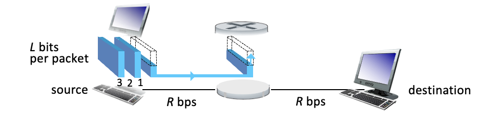
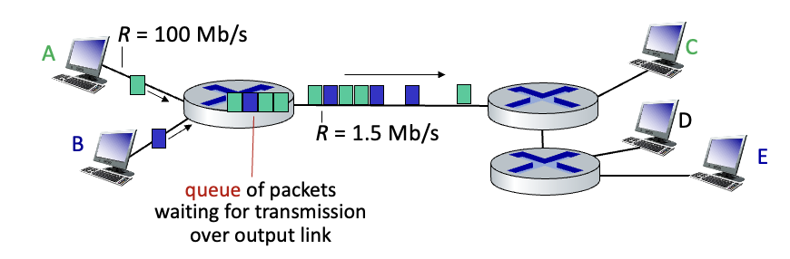
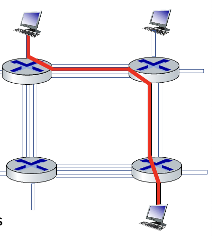

# Network Core

- mesh of interconnected routers
- *packet-switching*
  - Hosts break application-layer messages into *packets*
  - Network forwards packets from one router to the next, across links on path from source to destination
  - Link: switching & resource allication
  - Node: Routing & Forwarding
  - Network: Network Core Structure/ Management / Coordination

## Packet-switching

### One-hop

- Sender -> Router -> Destination

- **Packet transmission delay**: Takes *L*/*R* seconds to transmit (push out) *L*-bit packet into link at *R* bps
- **Store and forward**: Entire packet must arrive at router before it can be transmitted on next link
- **end-end delay** = 2*L*/*R*

### Queueing

- **Queueing** occurs when the packets arrive faster than they can be utilized. Effectively a network traffic jam.
- Packet queuing and loss: if arival rate (in bps) to link exceeds transmission rate (bps) of link for some period of time:
  - Packets will queue, waiting to be transmiitted on output link
  - Packets can be dropped (lost) if memory (buffer) in router fills up

## Circuit switching

- End-end resoruces allocated to reserved for "call" between soruce and destination

- Each link has 4 circuts
- Call gets 2nd circut on the top link, and 1st on the right link
- These are a **dedicated resource**, meaning they cannot be shared
  - Circuit-like (guaranteed) performance
- Circut segments idle if not used by a call (no sharing of resources)
- Commonly used in traditional telephone networks

### Circuit switching: FDM and TDM

- Frequency Division Multiplexing (FDM):
  - 
  - Optical/electromagnetic frequencies divided into (narrow) frequency bands
  - Each call allocated its own band, can transmit at max rate of that narrow band
- Time Division Multiplexing (TDM):
  - 
  - time divided into slots
  - Each call allocated periodic slot(s), can transit at maximum rate of (wider) frequency band, only during its time slot
    - Akin to a round-robin

## Packet Switching vs Circuit Switching

- Pros of packet switching:
  - Great for burst-y data due to its resource sharing
  - Simpler due to no complex call setup whatsoever
- Cons of packet switching:
  - Packet delay and loss
  - Protocols needed for reliable data transfer and congestion control

