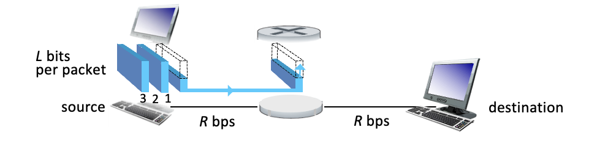
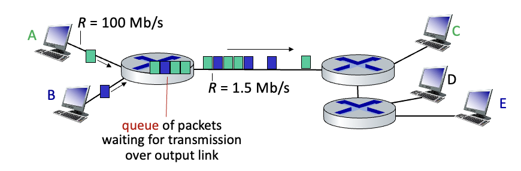
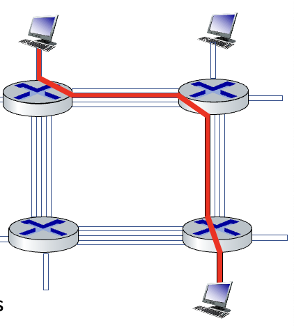
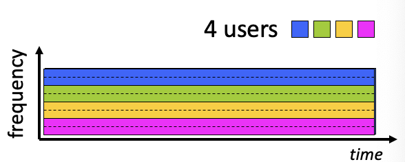
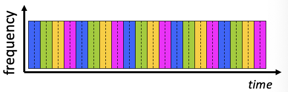
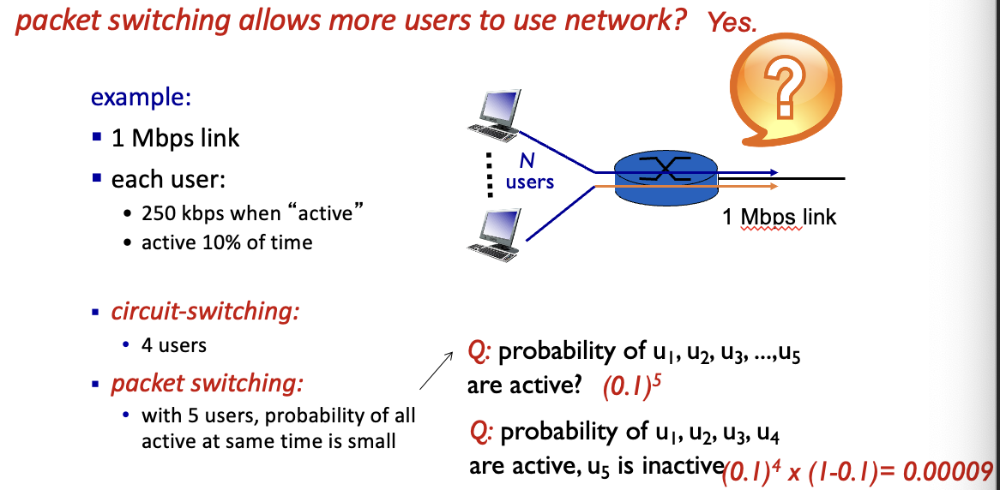
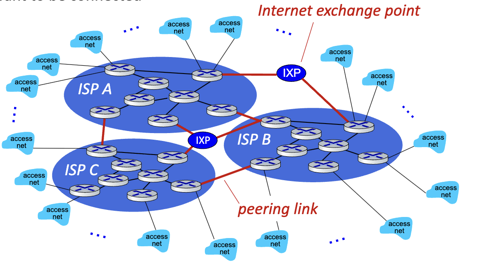
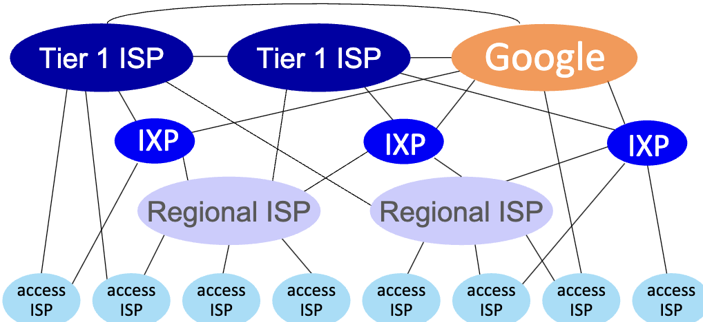
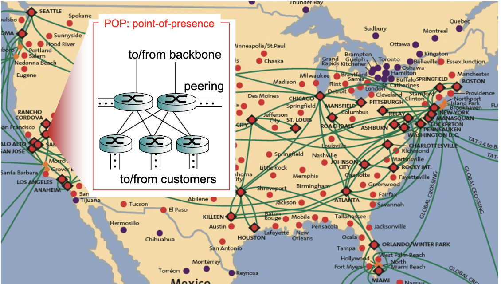

# Network Core

- mesh of interconnected routers
- *packet-switching*
  - Hosts break application-layer messages into *packets*
  - Network forwards packets from one router to the next, across links on path from source to destination
  - Link: switching & resource allocation
  - Node: Routing & Forwarding
  - Network: Network Core Structure/ Management / Coordination

## Packet-switching

### One-hop

- Sender -> Router -> Destination

- **Packet transmission delay**: Takes *L*/*R* seconds to transmit (push out) *L*-bit packet into link at *R* bps
- **Store and forward**: Entire packet must arrive at router before it can be transmitted on next link
- **end-end delay** = 2*L*/*R*

### Queueing

- **Queueing** occurs when the packets arrive faster than they can be utilized. Effectively a network traffic jam.
- Packet queuing and loss: if arrival rate (in bps) to link exceeds transmission rate (bps) of link for some period of time:
  - Packets will queue, waiting to be transmitted on output link
  - Packets can be dropped (lost) if memory (buffer) in router fills up

## Circuit switching

- End-end resources allocated to reserved for "call" between source and destination

- Each link has 4 circuits
- Call gets 2nd circuit on the top link, and 1st on the right link
- These are a **dedicated resource**, meaning they cannot be shared
  - Circuit-like (guaranteed) performance
- Circuit segments idle if not used by a call (no sharing of resources)
- Commonly used in traditional telephone networks

### Circuit switching: FDM and TDM

- Frequency Division Multiplexing (FDM):
  - 
  - Optical/electromagnetic frequencies divided into (narrow) frequency bands
  - Each call allocated its own band, can transmit at max rate of that narrow band
- Time Division Multiplexing (TDM):
  - 
  - time divided into slots
  - Each call allocated periodic slot(s), can transit at maximum rate of (wider) frequency band, only during its time slot
    - Akin to a round-robin
    - Each device is allotted time irrespective of wether it has anything to send or not.

## Packet Switching vs Circuit Switching

- Pros of packet switching:
  - Great for burst-y data due to its resource sharing
  - Simpler due to no complex call setup whatsoever
- Cons of packet switching:
  - Packet delay and loss
  - Protocols needed for reliable data transfer and congestion control

## Network Structure

- hosts connect to internet via Internet Service Providers (ISPs)
- ISPs in turn must be interconnected
  - this means that any two hosts can be anywhere around the world and still send packets to each other
- Resulting 'network of networks' is very complex, its evolution often driven by economics and national policies
- 
- There are also Content Provider Networks (Google, microsoft, amazon) that bring services and content closer to end users, bypassing ISPs.
- 
  - At the "center", a small # of well-connected and large networks
  - "Tier-1" commercial ISPs (AT&T, Spectrum, etc.): National and international coverage
  - content provider networks: Private network that connects its data centers to internet, often bypassing tier-1 and regional ISPs
  - ex: google.com
    - first we go to WPIs local isp.
    - Then, it routs through whatever WPIs regional ISPs.
    - Googles servers then receive the request, and then sent requests between each other before sending back to the client

### Point of Presence

- 
- Infrastructure that contains large network switches to send the end data to clients
