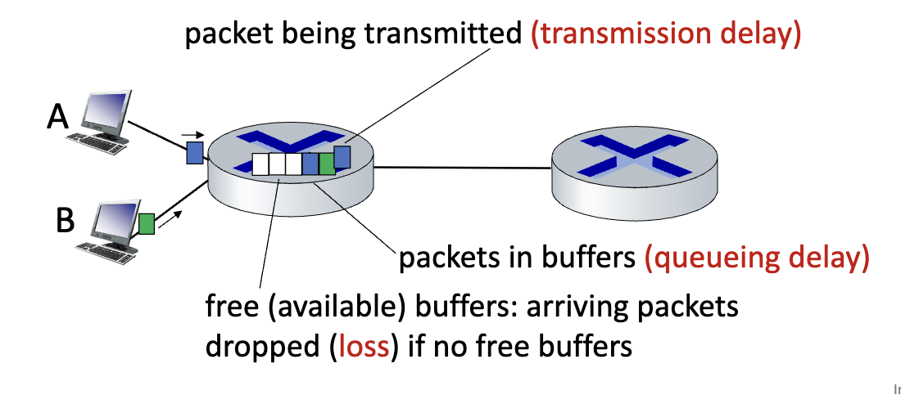
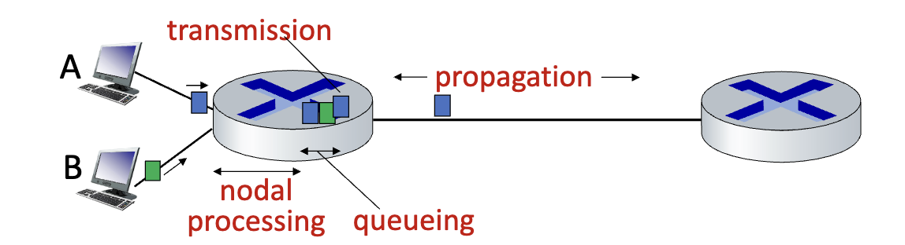
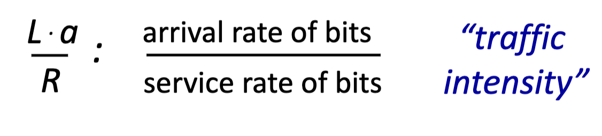
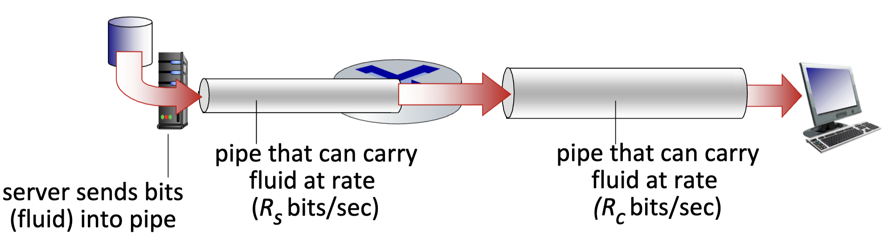
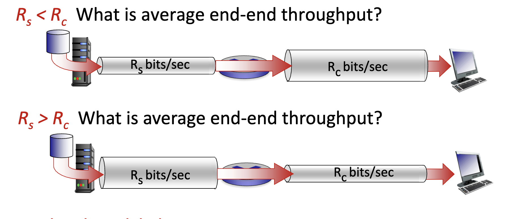

# Network Performance

- Packets *queue* in router buffers, waiting for their turn to transmit
  - Queue length grows when arrival rate to link exceeds output link capacity
- Packet *loss* occurs when memory to hold queued packets gets filled.

## Packet Delay Calculations

- Dnodal = Dproc + Dqueue + Dtrans + Dprop
  - Dproc: Nodal Processing
    - check for bit errors
    - determines output link
    - typically < microseconds
  - Dqueue: Queueing Delay
    - Time waiting at output link for transmission
    - depends on congestion level of router
    - microsecond to millisecond
  - Dtrans: Transmission Delay
    - L: packet length (bits)
    - R: link transmission rate (bps)
    - Dtrans = L/R
      - ex: L/R = 10Mbits/200Mbps = 0.05seconds
  - Dprop: Propagation delay
    - D: length of physical link
    - S: propagation speed (example: ~2x10^8 m/sec)
      - Different transmission media have different speeds
    - Dprop = D/S
      - ex: D/S = 20000km/2x10^8m/sec = 0.1seconds

## Packet Queueing Delay

- a: Average packet arrival rate
- L: packet length (bits)
- R: link bandwidth (bit transmission rate)
- 

## Throughput

- rate (bits/time unit) at which bits are being sent from sender to receiver
  - Average: rate over long period of time
  - instantaneous: rate at given point in time
  - 
- End-to-end throughput is determined by the *bottleneck-link* capacity
  - 
