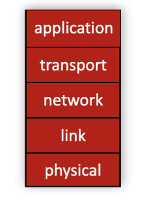
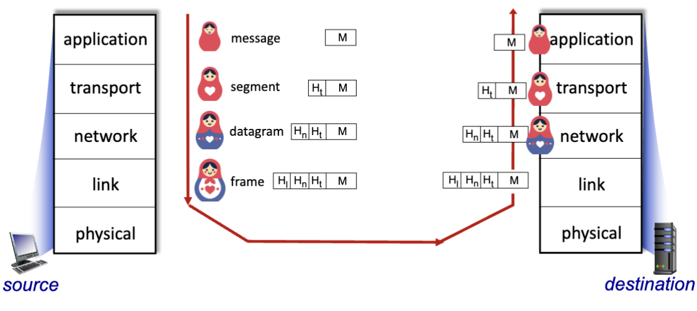

# Protocol Layers

- Helps dealing with complex systems
- Structured way to discuss the layout of complex systems
  - Layered *reference model* for discussion
- Modularization eases maintenance, updating of system
  - Change of implementation of layer's service transparent to the rest of the system
  - ex: change in gate procedure doesn't affect the rest of the system
- Layering considered harmful in some cases:
  - Duplicated functionality in different layers, such as error checking
  - Functionality at one layer needs info from other layers to function.

## Layered Network Protocol Stack

- *Application*: Supporting network applications
  - http, imap, smtp, dns
- *Transport*: Process to process data transfer
  - TCP, UDP
- *Network*: routing of datagrams from source to destination
  - IP, routing protocols
- *link*: data transfer between neighboring network elements
  - Ethernet, 802.11 (WiFi), PPP
- *Physical*: bits "on the wire"

### How a message is sent

- application exchanges messages to implement some application service using services of transport layer
- transport-layer protocol transfers message from one process to another, using services of network layer.
- Network-layer protocol transfers transport-layer segment [Ht | M] from one *host* to another, using link layer services
- Link-layer protocol transfers datagram [Hn | Ht | M]
- Physical link is simply just bits being sent over a wire

