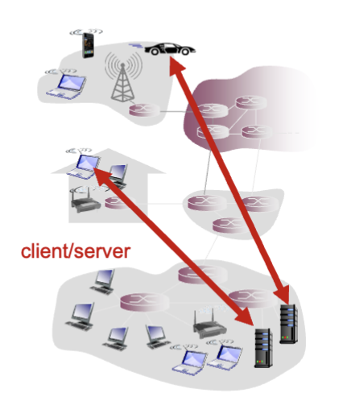
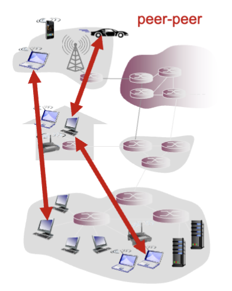
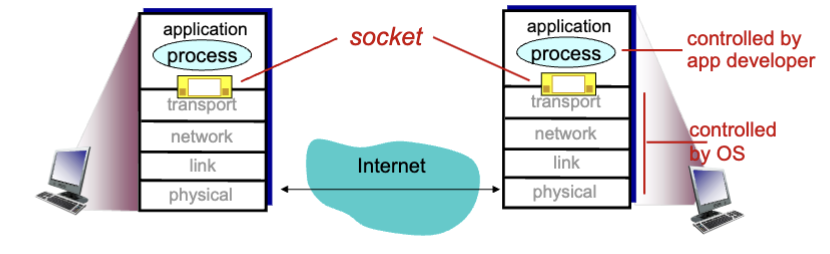

# Application Layer

## Network App

- To make a network app, we must:
  - Run on different end systems
  - Communicate over network
  - Network-core devices do not run user applications

### Client-server architecture

- Server:
  - Always-on host
  - Permanent IP address
  - Data centers for scaling
  - 

- Clients:
  - Communicate with server
  - may be intermittently connected
  - may have dynamic IP addresses
  - do not communicate directly with each other
  - 

### P2P Architecture

- No always-ons server
- Arbitrary end systems directly communicate
- Peers request service rom other peers, provide service in return to other peers
  - Self scalability - new peers bring new service capacity, as well as new service demands
- Peers are intermittently connected and change IP addresses

## Process communication

- Process: program running within a host
  - Within the same host, two processes communicate using inter-process communication (IPC), which is defined by the OS
  - Processes in different hosts communicate by exchanging messages via sockets
- Client process: process that initiates communication
- Server process: process that waits to be contacted
- Applications with p2p architectures have client processes and server processes

### Sockets

- Processes send/receive messages via its socket
- Sockets analogous to a door/mailbox
  - Sending process shoves message out the door/drop it off in a mailbox
  - Sending process relies on internet transport infrastructure on other side of the door to deliver message to socket at receiving process
  - 
