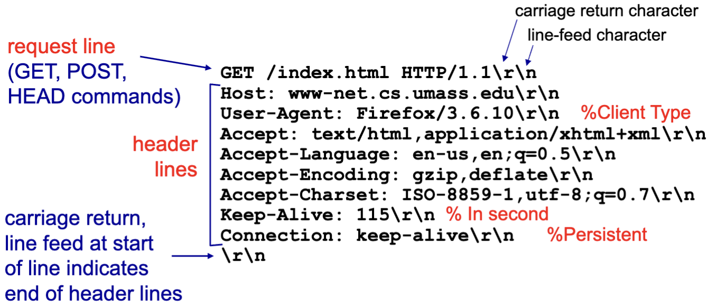

# Web and HTTP

## Webpages

- A web page consists of objects
- Object can be HTML file, JPEG image, Java applet, audio file, etc
- Each website has a base HTML file which includes several referenced objects
- Each object is addressable by a Uniform Resource Locator (URL)

## HTTP: Hypertext transfer protocol

- Webs application layer protocol
- client/server model 
  - Client: browser that requests (using http protocol), receives and displays web objects
- Server:
  - sends http objects in response to requests
- HTTP uses TCP (transmission control protocol)

1. Client initiates TCP connection (creates socket) to server, port 80
2. Server accepts tcp connection from client
3. HTTP messages exchanged between browser and web server
4. TCP connection closed

- HTTP is stateless
  - Server maintains no information about past client requests

## (Non)-persistent HTTP

- Non:
  - At most one object sent over TCP connection
    - Connection is then closed
  - Downloading multiple objects required multiple connections
- persistent:
  - Multiple objects can be sent over single tcp connection

### Example

- Left is non, right is persistent

- Non persistent:
  - T=N \* (2 \* RTT + Tobj)
- Persistent:
  - T=2 \* RTT + N \* T

## HTTP Request Types

- Request, response
- HTTP request message:
  - ASCII (human-readable format)

  - Header lines are optional

### POST:

- Web page often includes input
- input is uploaded to server in entity body
- Request from webserver with user input like search keywords (form being completed)

### GET+URL:

- uses GET method
- input is uploaded in url field of request line
