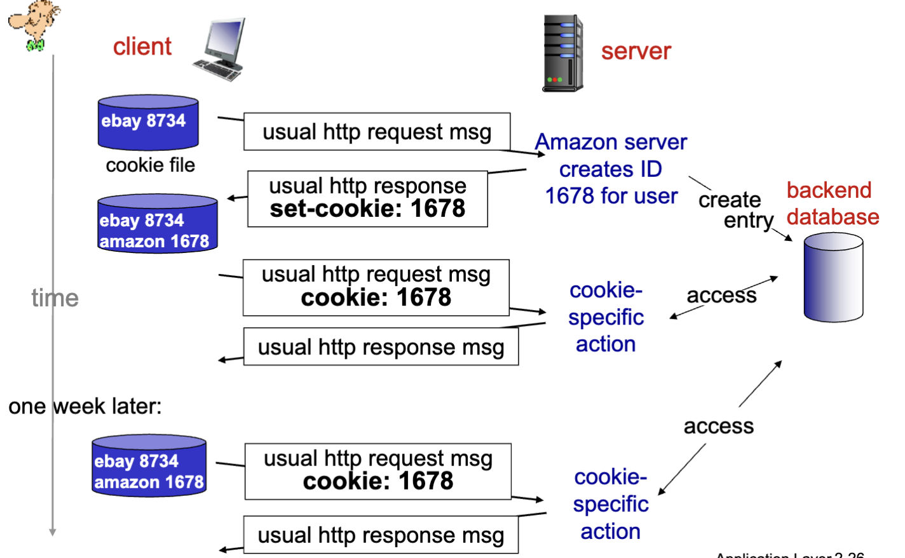

# Cookies

## Web-server state: cookies

- they contain four components

1) cookie header line of HTTP response message
2) cookie header line in next HTTP request message
3) cookie file kept on user's host, managed by the user's browser
4) back-end database at Website

- ex:
  - When an inital HTTP requests arrives at a site, the site creates a unique ID and an entry in backend DB for ID
  - This ID will be saved in the cookie

### Usage

- Authorization
- Shopping carts
- recommendations
- user session state (Web e-mail)
