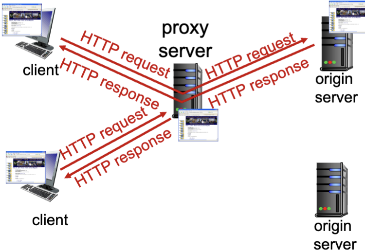

# Web Proxy

## Web caches (proxy server)

Goal: Satisfy client request without involving origin server

- User sets browser: WEB access via cache
- Browser sends all http requests to cache
  - If there objects in cache: cache returns object
  - else: cache requests object from origin server, then returns object to client

### Why use it?

- Client: reduces response time for client server
- Access: reduce traffic on an institution's access link
- Internet: In an internet dense with caches, it enables 'poor' content providers to effectively deliver content (so too does P2P file sharing)
