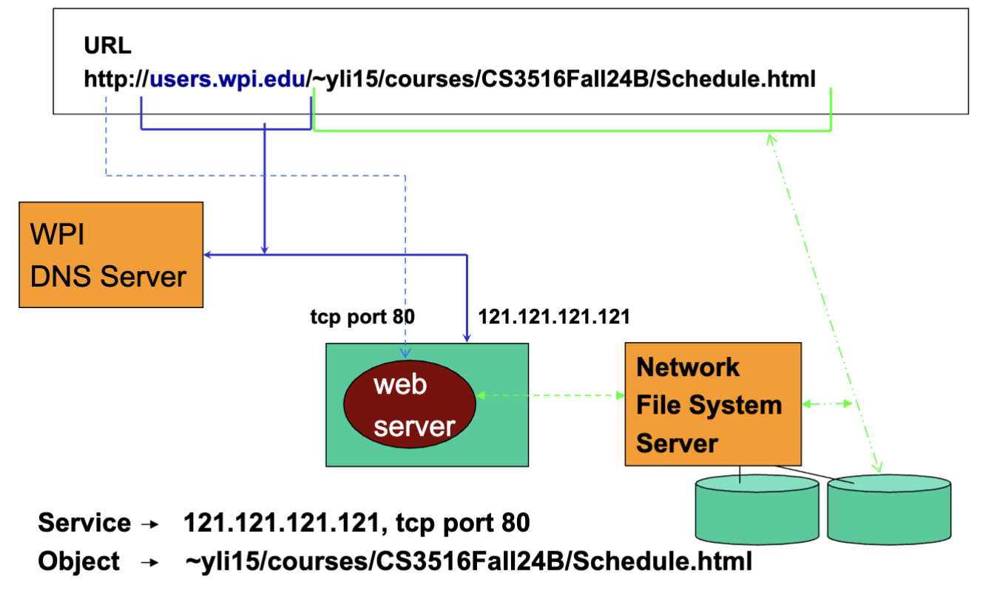
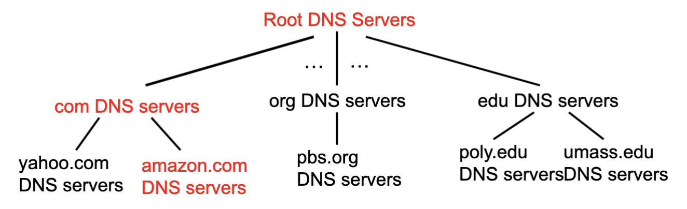
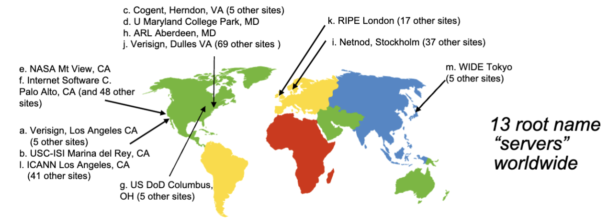
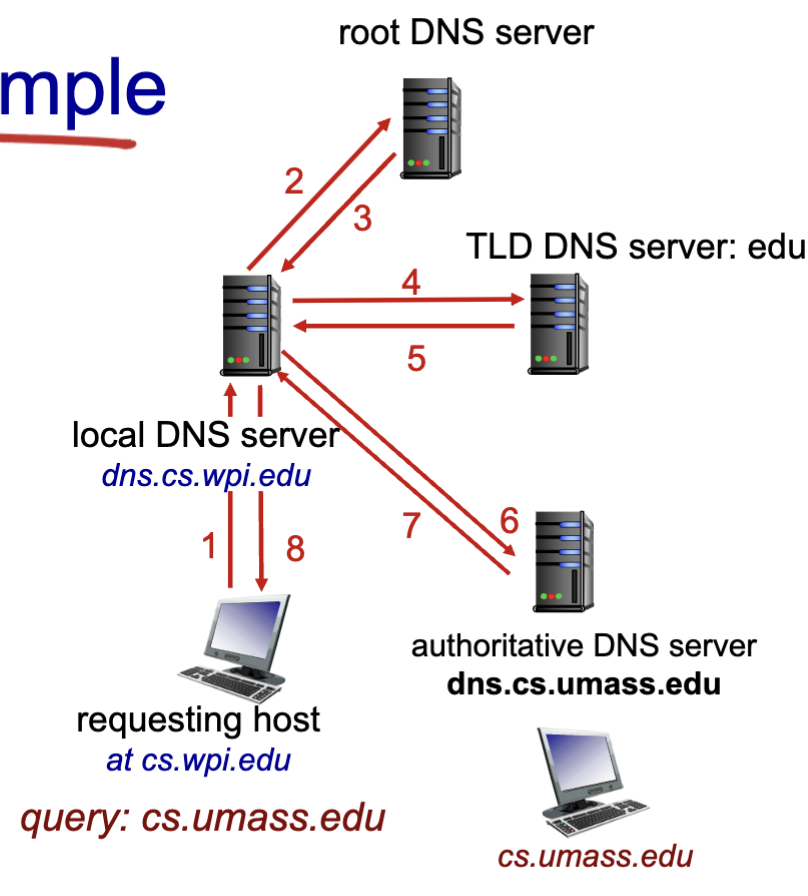
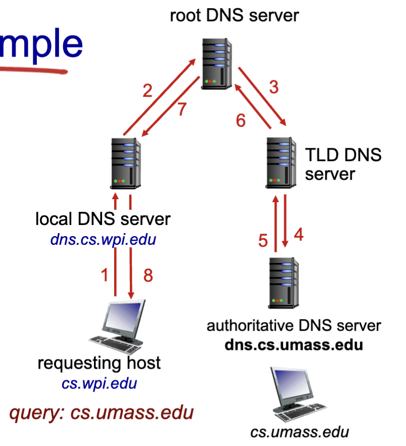
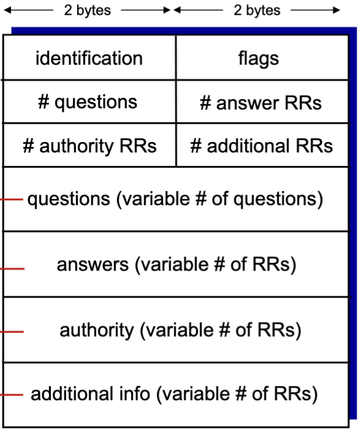

# DNS: Domain Name System

- People: Many identifiers
  - SSN, Name, passport number
- Internet hosts, routers
  - IP address (32 bit) - used for addressing datagrams
  - "name": domain name like "www.google.com".

- **The domain name system works similarly to this**
  - It is a distributed database
    - Implemented in hierarchy of many *name servers*
  - Application Layer protocol
    - Hosts, name servers communicate to resolve names (address/name translation)
    - Core internet function, implemented as application layer protocol

## DNS Services

- Hostname to IP address translation
- Host Aliasing
  - There are many servers for large websites
  - Ex: google might have servers in multiple parts of the world, each with different internal domain names
    - web1.google.com; web2.google.com, us.google.com, australia.google.com, etc.
- Mail server aliasing
- Load distribution
  - Replicated web servers: many ip address correspond to one name

## Distribution of DNS database

- DNS is decentralized
  - Prevents there being a single point of failure
  - spreads out traffic volume
  - If maintenance would be performed, the internet would stop funcitoning
  - Speeds up load times

- Order:
  - root
  - top
  - authoritative
- If a client wants the IP for amazon.com:
  - client queries root server to find the .com DNS server (aka a Top Level Domain server)
  - client queries .com DNS server to get amazon.com DNS server
  - client then queries amazon.com DNS server to get the IP addresse for www.amazon.com

## DNS: Root name servers

- There are 13 root name "Servers" worldwide

- Contacted by local name server that cannot resolve name
  - root name server:
    - contacts authoritative DNS server if name mapping not known
    - gets mapping
    - returns mapping to local name server

## TLD: Authoritative Servers (ADNS)

- Each TLD has its own server, managed by an organization
  - .com, .org, .net, ...
  - and all top-level country domains: .uk, .fr, .ca, .jp...
  - Network Solutions maintains servers for .com TLD
  - Educase for .edu TLD
- Authoritative DNS servers:
  - Organization's own DNS server(s), providing authoritative hostname to IP mappings for organizations named hosts
  - can be managed by organization, or their service provider

## Local DNS name server

- Does not strictly belong to the hierarchy
- Each ISP (Residential isp, company, university) has one
  - Also called "default name server"
- When host makes DNS query, query is sent to its local DNS server
  - Has local cache of recent name-to-address translation pairs (could become out of date)
  - Acts as proxy, forwards query into hierarchy if unknown name, then saves the returned name-to-address pair.
    - If local DNS server does not have the pair, it will send to the hirearchy (ADNS)

## DNS Name resolution example

- Host at cs.wpi.edu wants IP address for cs.umass.edu
- **Iterated query**
  - Contacted server replies with name of server to contact if it doesn't know the ip
  - This continues up the chain until the IP is resolved
  - 
- **Recursive query**
  - Puts burden of name resolution on contacted name server
  - Puts heavy load at upper levels of hierarchy
  - 

## Caching and updating records

- Once (any) name server learns mapping, it caches mapping  
  - Cache entries timeout after some time (TTL, time to live)
  - TTL servers typically are cached in local name servers
    - reduces load on root name servers
  - Cached entries may become out-of-date
    - If name host changes ip addresses, it may not be known internet wide until all TTLs expire

## DNS Data Format

### Resource records (RR) format:

- `(name, value, type, ttl)`
  - Type=a
    - name is hostname
    - value is ip address
  - Type=NS
    - name is domain
    - value is hostname of authoritative name server for this domain
  - Type=CNAME
    - name *is* alias name for some 'canonical' name
      - `www.ibm.com`is reaally `servereast.backup2.ibm.com`
    - value is canonical name
  - Type=MX (mail service)
    - Value is name of mail server associated with name

### DNS protocol messages

> Query and reply messages are in the same format

- Identification:
  - 16-bit number for query
  - reply to query uses same number
- Flags:
  - Query of reply (1 bit)
  - Recursion desired      (query) (1 bit)
  - Recursion available    (reply) (1 bit)
  - Reply is authoritative (reply) (1 bit)
    - DNS server is an authoritative DNS for a queried name

## Inserting new records into DNS

- Example: networkabc
  - Register name networkabc.com at DNS registrar and pay a fee for it
    - Provide names, ip addresses or authoritative name servers (primary and secondary)
    - registrar inserts two RRs into .com TLD server:
      - (nerworkabc.com,      dns1.networkabc.com, NS)
      - (dns1.networkabc.com, 212.212.212.1,       A)
    - Authoritative server (dns1)
      - Create type A record for www.networkabc.com;
        - (www.networkabc.com, 212.212.212.3, A)
      - Create type MX record for
        - (www.networkabc.com, mail.networkabc.com, MX)
