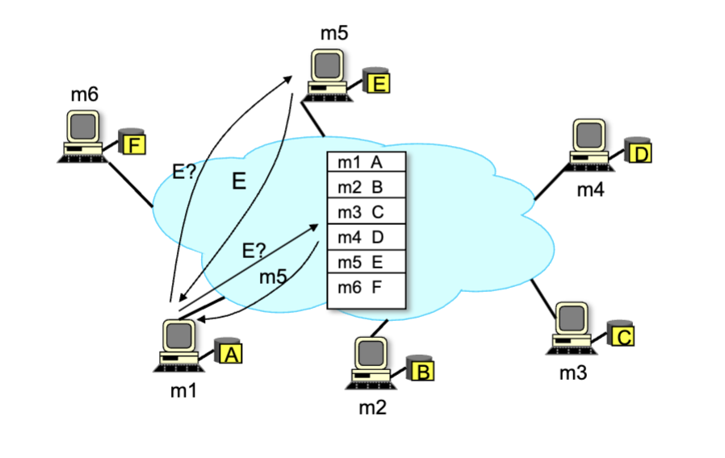
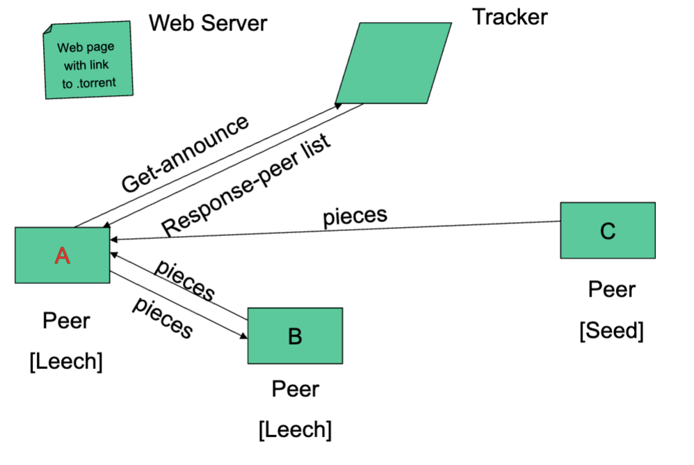

# Peer-to-Peer Networks

## Napster

- Key idea: share the content, storage and bandwitch of multiple home users

### Model

- Each user stores a subset of files
- Each user has access (can download) to files from all users in the system

### Example

- User contacts Napster (via TCP)
- Client searches for a title or performer
- Client requests the file from the chosen supplier

### Challenges

- Scale: up to hundreds of thousands of machines
- Dynamic: Machines can come and go at any time
- Main challenge: the difficulty of finding where a particular file is stored

### Limitations of Central Directory

- File transfer is decentralized, but locating content is highly centralized.
  - Single point of failure
  - Performance bottleneck

## Bit Torrent

- Divide large file into many pieces (256Kbytes)
  - Replicate different picces on different peers
  - A peer with a complete piece can trade with other peers
  - Peers can (hopefully) assemble the etnire file
  - Allows for simultaneous downloading
    - Retrieving different parts of the file from different peers at the same time

### Components

- Seed
  - Peer with entire file
  - Fragmented into pieces
- Leech
  - Peer with an incomplete copy of the file
- Torrent file
  - Passive component
  - Stores summaries of the pieces to allow peers to verify their integrity
- Tracker
  - Allows peers to find each other
  - Returns a list of random peers

### Example

- we have a web server, tracker, peer a/b (leech), peer c (seed)

1) Peer A downloads a .torrent file from a webserver
2) Upon opening, a message is sent to the Tracker, and it then sends back a response-peer list
3) Peer A, having learned the other peers, handshakes to B and C
4) Pieces are then sent from peers B and C to create the full file. A will also send pieces back to B

### Free-Riding problem in P2P

- Vast majority of users are free-riders
  - Most share no files and answer no queries
  - Others limit # of connections or upload speed
- A few "peers" essentially act as servers
  - A few individuals contributing to the public good
  - making them hubs that basically act as a server
- BitTorrent prevent free riding
  - Each peer allows the fastest peer to download
  - Occasionally let some free peers download

### Priority in requesting chunks:

- at any given time different peers have different subsets of file chunks
- periodically, peer A asks each peer for list of chunks that they have
- A requests missing chunks from peers, rarest first
- A sends chunks to those four peers currently sending As chunks at highest rate
  - Other peers are choked by A (do not receive chunks from A)
  - Re evaluate top 4 every 10 seconds
- Every 30 secs: randomly select another peer, starts sending chunks
  - "optimistically unchoke" this peer
  - Newly chosen peer may join top 4
  - Occasionally allows some free peers