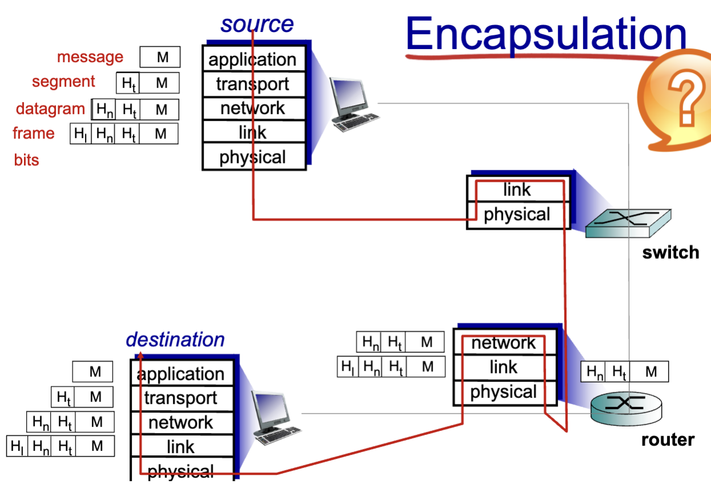

# Transport Layer

## Transport-layer Services

### Transport services and protocols

- Provide logical communication between application processes running on different hosts
- Transport protocols actions in end system
  - Sender: breaks application messages into segments, passes to network layer
  - Receiver: resembles segments into messages, passes to application layer
- Two transport protocols available to internet applications
  - TCP, UDP
- Overall, the transport layer communicates between processes
  - Relies on and enhances network layer services
  - The network layer is for communication between hosts

### Internet transport-layer protocols

- Reliable, in-order delivery (TCP)
  - retransmission
  - congestion control
  - flow control
  - connection setup
- Unreliable, unordered deliver: UDP
  - no-frills extension of "best-effort" IP

## Multiplexing and Demultiplexing

- **Multiplexing** is the process of combing two or more information channels into a single transmission medium
- **Demultiplexing (demux)** is the process of directing incoming messages to the appropriate clients based on specific fields in the protocol headers.
- UDP: demultiplexing using destination port number only
- TCP: demultiplexing using 4-tuple.

### Multiplexing at sender

- Handle data from multiple sockets, add transport header (later used for demultiplexing)

### Demultiplexing at receiver

- Use header info to deliver received segments to correct socket

### Connection-less demultiplexing

- When host receives UDP segments:
  - Checks destination port # in segment
  - Directs UDP segment to socket with that port #
  - IP datagrams with same dest. port #, but different source IP addresses and/or source port numbers will be directed to same socket at dest

### Connection-oriented demux

- TCP socket identified by 4-tuple
  - source IP address
  - source port number
  - dest IP address
  - dest port number
- demux: receiver uses all four values to direct segment to appropriate socket
- Server host may support many TCP sockets:
  - each socket identified by its own 4-touple

## Connectionless transport: UDP

- User Datagram protocol
  - "best effort" service; segments may be:
    - Lost
    - delivered out-of-order
  - Connectionless
    - no handshaking between sender and receiver
    - each segmend handled independently of others
    - USP use:
      - streaming multimedia apps (loss tolerant, rate sensitive)
      - DNS

### Format

- Length in bytes of USP segment, including header

## Checksum

- Goal: detect "Errors" aka flipped bits in transmitted segment
- Sender:
  - Treat segment contents, including header fields, as sequence of 16-bit integers
  - checksum: addition (ones complement sum) of segment content
  - Sender puts checksum value into UDP checksum fields
- Receiver:
  - compute checksum of received segment
  - check if computed checksum equals checksum field value:
    - FALSE - error detected
    - TRUE - no error detected (could still be errors)

