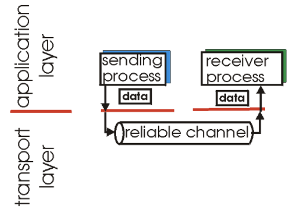
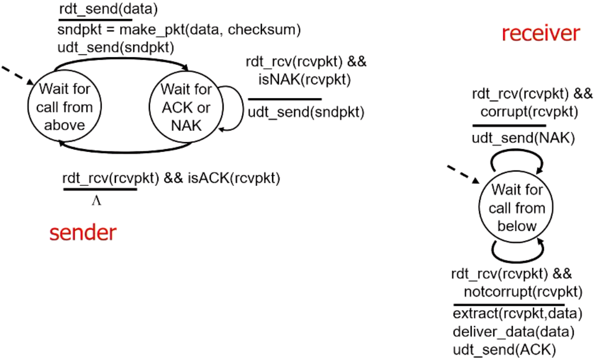

# Reliable Data Transfer

## Principles of reliable data Transfer

- Important in application, transport, link layers
- characteristics of unreliable channel will etermine complexity of reliable data transfer protocol (rdt)

