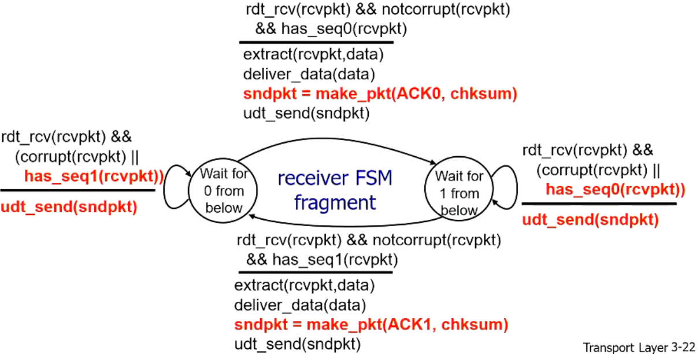

# Reliable Data Transfer

## Principles of reliable data Transfer

- Important in application, transport, link layers
- characteristics of unreliable channel will determine complexity of reliable data transfer protocol (rdt)

## Getting started

- Incrementally developing sender, receiver sides of rdt protocol
- consider only unidirectional data transfer
  - but control info will flow both directions
- use finite state machines (FSM) to specify sender, receiver

## rdt1.0: Reliable transfer over a reliable channel

- underlying chanel perfectly reliable
  - no bit errors
  - no loss of packets
  - still may arrive out of order
- Separate FSM for sender, receiver
  - Sender sends data into underlying channel
  - Receiver reads data from underlying channel

## rdt2.0: Channel with bit errors

- Underlying channel may flip bits in packet
  - checksum to detect bit errors
- How to recover from errors
  - Acknowledgement (ACKs): receiver explicitly tells sender that packet is ok
  - Negative Acknowledgement (NAKs): receiver explicitly tells sender that packet had errors
  - Sender retransmits packet on recept of NAK
- New mechanisms in rdt2.0 (building upon 1.0)
  - error detection
  - feedback: control messages (ACK,NAK) from receiver to sender

### Fatal flaw - If ACK/NAK becomes corrupted

- Sender doesn't know what happened at receiver
  - 1: Keep sending NAKs back and forth [X]
    - can infinitely run, and can still be corrupted
  - 2: enough checksum to recover [X]
    - What if checksum gets corrupted?
    - The larger a checksum, the longer the packet and the larger chance for corruption
  - 3: corruption? retransmit
    - Cant simply just retransmit - it would cause a duplicate packet
- Handling duplicates:
  - sender retransmits packet if ACK/NAK corrupted
  - Sender adds sequence number to each packet
  - receiver discards dupliate packet number

## rdt2.1

### Sender, handles garbles ACK/NAKs

- sequence number (seq#) added to packet
- two sequence numbers (0,1) will suffice
  - Works as this is a 'send and wait' protocol
  - Packet 0 is only followed up by packet 1 when receiver sends ACK
  - 0/1 simply alternate
- must check if received ACK/NAK is corrupted
- Twice as many states
  - State must "remember" whether current packet should have seq# 0 or 1

### Receiver, handles garbles ACK/NAKs and duplicates

- Must check if received packet is duplicate
  - State indicates whether 0 or 1 is expected packet seq#

## rdt2.2: NAK-free protocol

- same functionality as rdt2.1, using ACKs only
- instead of NAK, receiver sends ACK for last packet received OK
  - receiver must explicitly include seq# of packet being ACKd
- Duplicate ACK at sender returns the same action as NAK: retransmit current packet

connecting these two segments, is a state waiting for 1 from below.

## rdt3.0: channels with error and loss

- new assumption:
  - underlying channel can also loose packets (data, ACKs)
  - checksum, seq#, ACKs, retransmissions will be of help but not enough
- approach: sender waits  "reasonable" amount of time for ACK
  - retransmits if no ACK received in this time
  - if packet or ACK just delayed, but not lost
    - retransmission will be duplicate but current logic from previous rdts would delete the retransmitted packet
    - the receiver must specify seq# of packet being acknowledge
  - requires countdown timer
- Long timer
  - slow to react to loss of acknowledgements
  - Reduces overall throughput

### Stop-and-wait operation

### Sender

### receiver: same as 2.2 receiver

