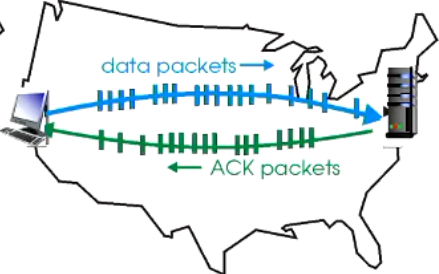
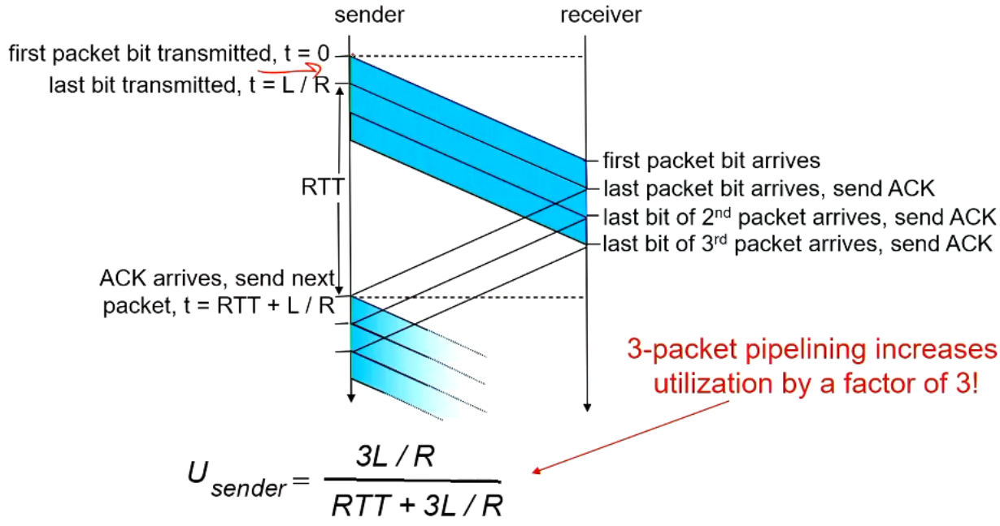
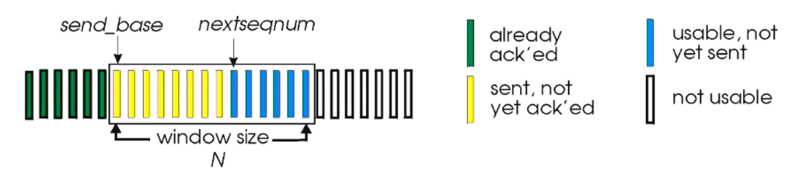
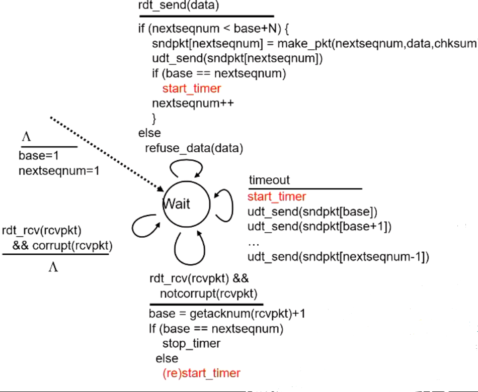
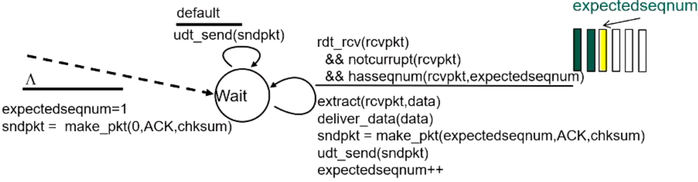
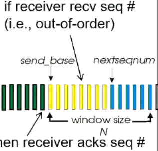
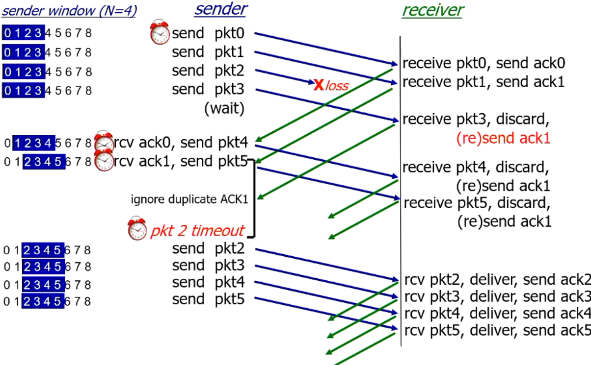

# Pipelined protocols

- pipelining: sender allows multiple "in-flight", yet to be acknowledged packets
  - range opf sequence numbers must be increased
  - buffering at sender and/or receiver
- two generic forms: go-back-N, selective repeat

## Go-Back-N

3 main changes over rtd3.0

- Sender can have up to N unACKed packets in pipeline
- receiver only sends cumulative ACK
  - does not ACK packet if there is a gap
- sender has timer for oldest unACKed packet
  - when timer expires, retransmits *all* unACKed packets

### Sender

- k-bit seq# in packet header
- "window" of up to N=2^k consecutive unACKed packets allowed
- ACK(n)
  - ACKs all packets up to (inclusive) seq# n
  - known as cumulative ACK
- timer for oldest in-flight packet
- timeout(n) retransmit packet n and all higher seq# packets in window

### Receiver

- ACK-onyl: always send ACK for correctly-received packet with highest in-order seq#
  - may generate duplicate ACKs
  - need only remember expectedseqnum
- out-of-order packet
  - discard (don't buffer): no receiver buffering
  - re-ACK packet with highest in-order seq#

### GBN in action

timer icon: start timer/restart timer/timeout

