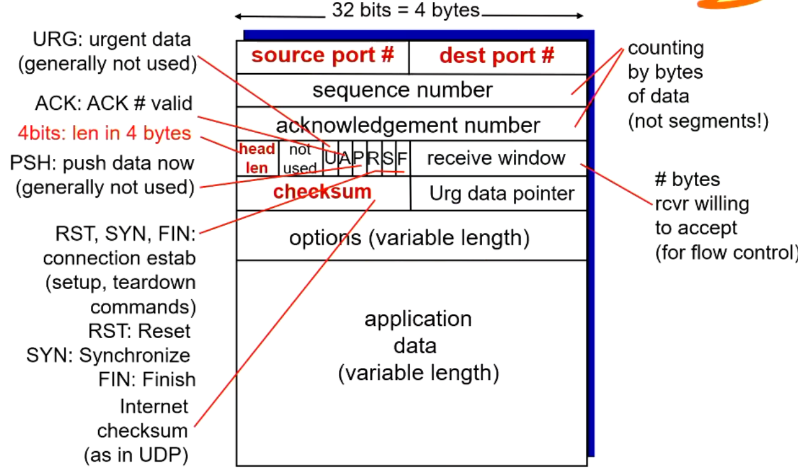
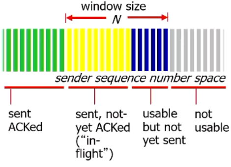
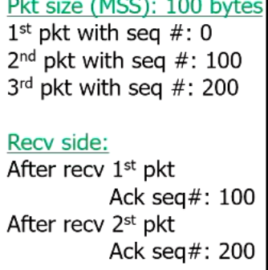
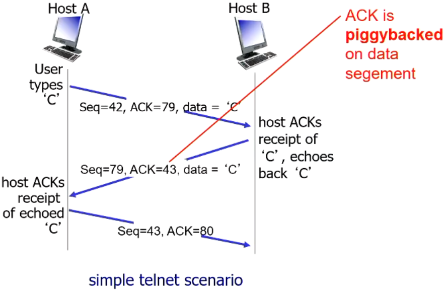
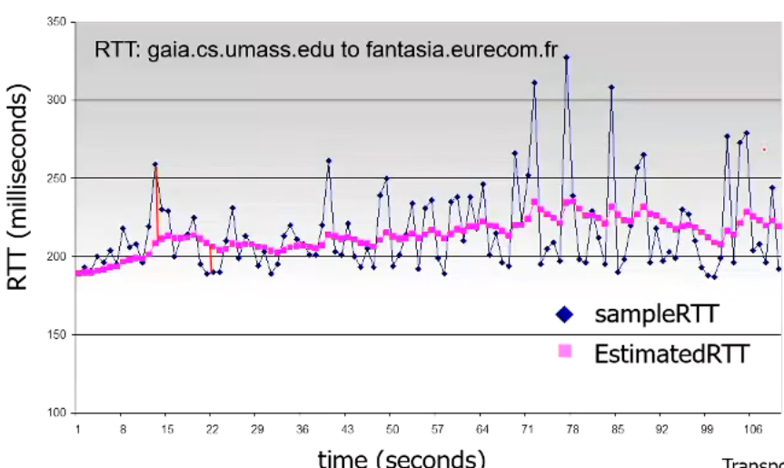
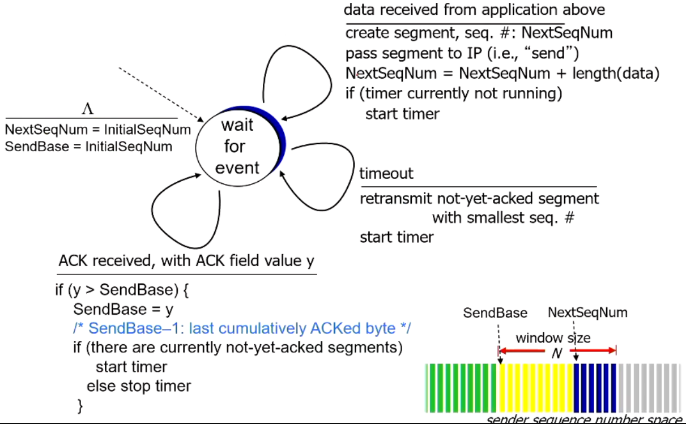
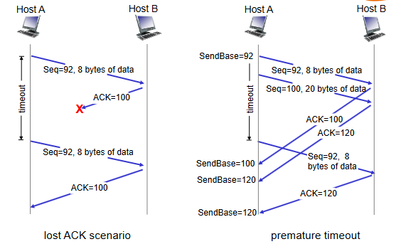
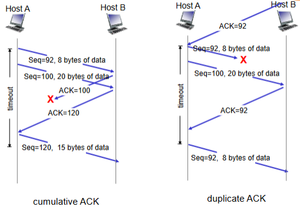
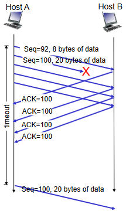
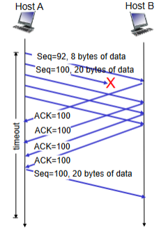

# Connection orientated transport (TCP)

- reliable, in-order byte stream
  - no "message boundaries"
- pipelined:
  - TCP window size
- Full duplex data
  - bi-directional data flow in same connection
  - MSS: maximum segment size of data
  - MTU: layer 3 maximum transmission unit (1500B for Ethernet)
- Connection-orientate:
  - Handshaking (exchange of control msgs) initializes sender and receiver state before data exchange

## TCP Segment structure

- 20+ bytes where as UDP is 8 bytes

## TCP Seq# & AKS

- seq#:
  - Byte stream number of first byte in segments data
- acknowledgements:
  - Seq# of next byte expected from other side
  - cumulative ACK
- TCP out of order segment handling is up to the implementor

### 3-way handshaking

## Round Trip Time and Timeout

- Timeout time must be longer than RTT
  - RTT varies
- If timeout is too short, premature timeout, unnecessary retransmission
- If timeout is too long, slow reaction to segment loss
- How do we estimate rtt?
  - SampleRTT: measured time from segment transmission until ACK received
    - ignores retransmissions
  - SampleRTT will vary, we want the estimated RTT to "smoother"
    - Average several recent measurements, not just current SampleRTT
    - This is called EstimatedRTT

### EstimatedRTT

`EstimatedRTT = (1 - a)*EstimatedRTT + a*EstimatedRTT`

- Exponential weight moving average
- Influence of past sample decreases exponentially fast
- typical value of a is 0.125

- Timeout Interval: EstimatedRTT plus a margin.
  - Large variation in EstimatedRTT means a larger margin will occur
- Estimate SampleRTT deviaton from EstimatedRTT
  - `DevRTT = (1-b)*DevRTT + b*|SampleRTT-EstimatedRTT|`
  - Typically, B is equal to 0.25
  - `TimeoutInterval = EstimatedRTT + 4*DevRTT`

## TCP reliable data transfer

- TCP creates rdt service on top of IPs unreliable service
  - pipelined segments
  - cumulative ACKs
  - single retransmission timer
- Retransmissions are triggered by
  - timeout events
  - Duplicate ACKs

### Simplified TCP sender (ignores duplicate ACKs)

### TCP retransmission scenarios

## TCP Fast retransmission

- TCP without fast retransmission

- time-out period often relatively long:
  - long delay before resending lost packet
- detect lost segments via duplicate ACKs
  - Sender often sends many segments back-to-back
  - if segment is lost, there will be likely be many duplicate ACKs
- Fast Retransmit:
  - if sender receives 3 duplicate ACKs for same data (aka "triple duplicate ACKs"), resend unACKed segment with smallest seq#
    - likely that unACKed segment was lost, so don't wait for timeout.
    - 
