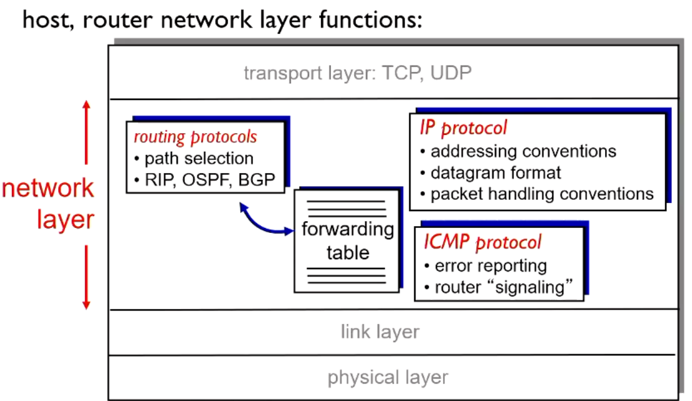
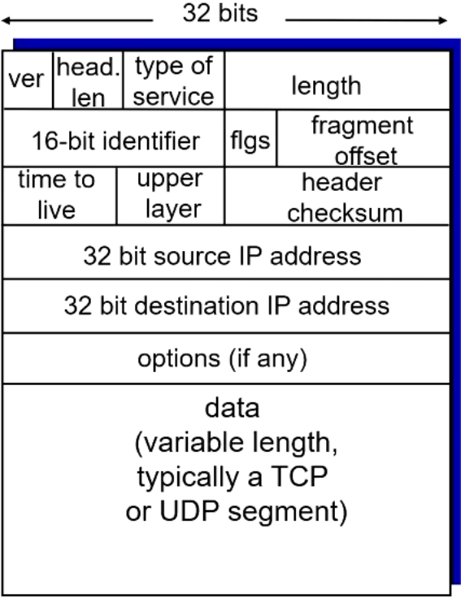

# Network Layer Services and Protocols

- Transport segment from sending to receiving host
  - sender: encapsulates segments into datagrams, passes to link layer
  - receiver: delivers segments to transport layer protocol
- network layer protocols are in every internet device: hosts, routers etc
  - Routers examine header fields in all IP datagrams passing through it and moves them from input to output ports to transfer datagrams along end to end path.

## Key network layer functions

- RIP: routing information protocol
- OSPF: open shortest path protocol
- BGP: border gateway protocol
- ICMP: internet control message protocol

### Forwarding

- Moving packets from a routers input link to an appropriate router output link

### Routing

- determine route taken by packets from sources to destination
  - routing algorithms

## IPv4 Datagram

- 20 bytes of header data for the datagram
- 20 bytes of header data for ip
- 40 bytes in total plus app layer

### IP Fragmentation, reassembly

uses the 16-bit identifier, flgs, and fragment offset field from datagram format

- Network links have MTU (maximum transfer size) - largest possible link level frame
  - Different link types, different MTUs
- Large IP datagram divided (fragmented) within network
  - one datagram becomes several smaller datagrams
  - reassembled only at the final destination
  - IP header bits used to identify and order related fragments
