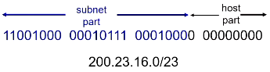
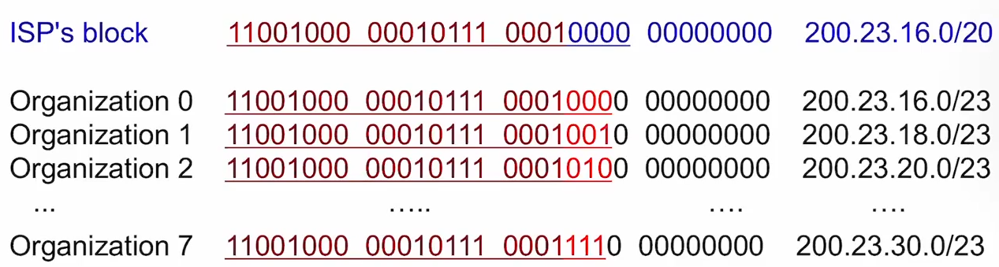
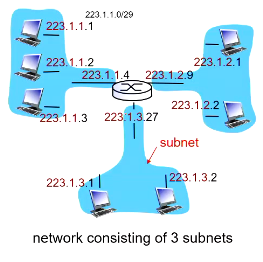
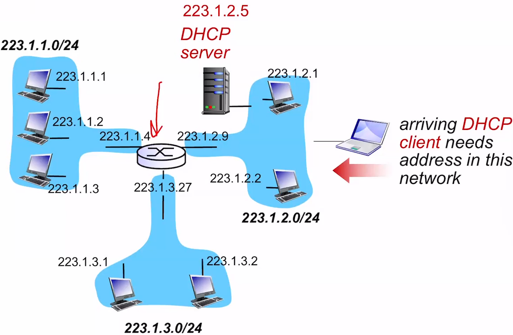
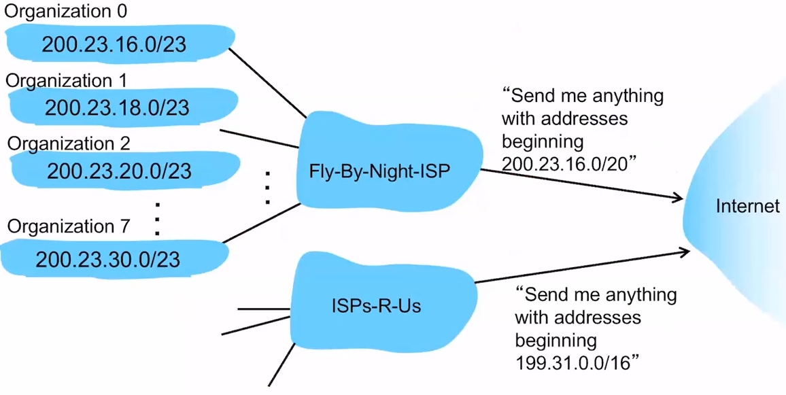

# IP Addressing

## CIDR

- Classless InterDomain Routing
- Subnet portion of address of arbitrary length
- Address format a.b.c.d/x where x is the number of bits in the subnet portion of the address

## IP Address

- IP Address is a 32-bit identifier for host, router interface
- interface: connection between host/router
  - routers typically have multiple interfaces
  - host typically has one or two interfaces (ethernet, wireless 802.11)
- IP addresses associated with each interface
  - subnet
  - group of IP addresses
  - group of interfaces

- First 20 bits are reserved for the ISP
- Networks are then allocated a portion of its providers ISP address space

## Subnets

- IP Address: a.b.c.d/x
  - subnet part - high order bits
  - host part - low order bits
- A subnet can physically reach each other without intervening with the router
- device interfaces with the same subnet part of ip address

## DHCP

- Goal: allows host to dynamically obtain its ip address from network server when it joins network
  - can renew the lease
  - allows reuse of addresses
  - support for mobile users
- DHCP overview
  - 1
    - Host broadcasts "DHCP Discovery" msg
    - DHCP server responds with "DHCP offer"
  - or 2
    - host requests ip address "DHCP request" msg
    - DHCPserver sends address "DHCP ack" msg
- Can return more than just IP addresses
  - Address of first-hop router for client
  - name and IP address of LDNS server
  - network mask (indicating network versus host portion of address)

## Hierarchical Addressing

- This allows for more efficient advertisement of routing information
- Starts from the 'largest' organization (200) - the isp, and works down the chain

## ICANN: Internet Corporation for Assigned Names and Numbers

- Allocates addresses
- manages DNS
- Assigns domain names, and resolves disputes
