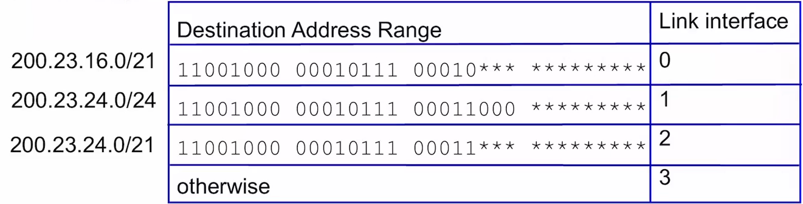
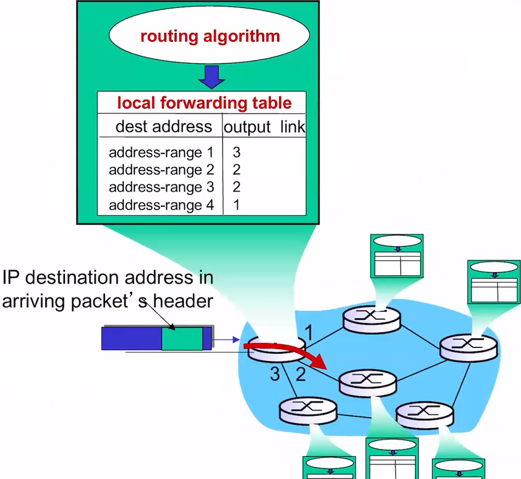
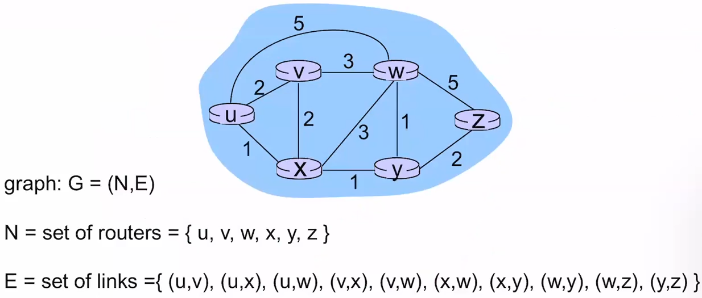
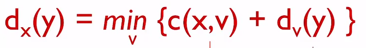
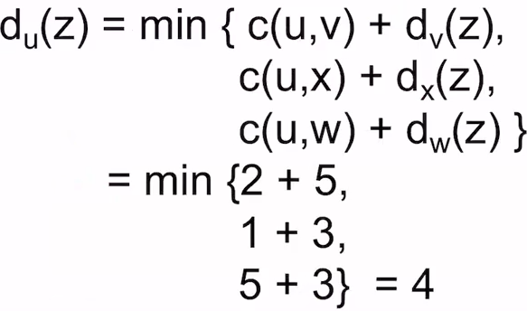
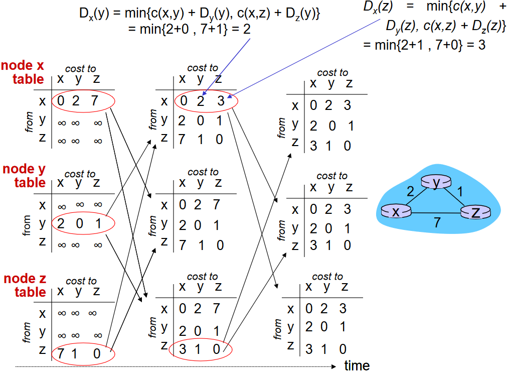
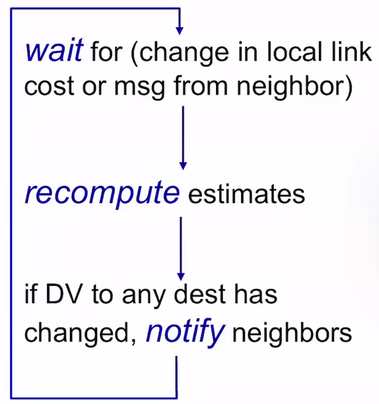

# Routing

## Longest prefix matching

- When looking for forwarding table entry for given destiation address, use *longest* address prefix that matches destination address
- With the above image as an example:
  - Address 11001000 00010111 00010110 10100001 -> interface 0
  - Address 11001000 00010111 00011000 10101010 -> Matches both 1/2. Since matches with more of 1, it will go to interface 1.

## Interplay between routing and forwarding

- internet is the blue blob
- each node has a local forwarding table with global knowledge of the network to ensure efficiency

## Routing algorithm

- determines end-to-end path through network
- used to make Forwarding table - relations that determine local forwarding at a specific router

- can be abstracted into a graph algorithm such as the below example:

- Each jump has a cost attached to it
- must find the least cost path

### Distance Vector

- Bellman-Ford equation
- let dx(y) = cost of least-cost path from x to y
- then:
  - 
  - where min is taken over all neighbors v of x
  - c(x,v) is the cost to neighbor v
  - dv(y) is the cost from neighbor v to destination y
- Ex: using same graph as abstracted above:
  - 

### Distance Vector Algorithm

- dx(y) = estimate of least cost from x to y
- node x:
  - x maintains distance vector Dx = [dx(y): y is an element of N]
  - Knows cost to each neighbor v: c(x,v)
  - maintains its neighbors' distance vectors. For each neighbor v, x maintains Dv = [dv(y): where y is an element of N]
  - keeps exchanging its distance vector (Dx) with its neighbors

#### overview

- Iterative, asynchronous:
  - each local iteration is caused by either a local link  cost change, or DV update message from neighbor
- Distributed:
  - each node notifies neighbors **only** when necessary (when its DV changes).

